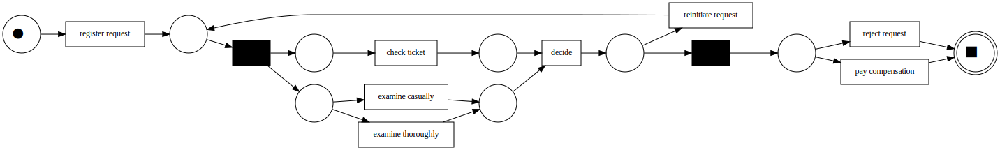
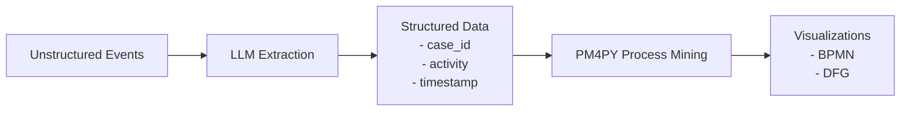

# Process Mining Demo
- Garrett Gruss
- 12/21/2025

## Overview

Process mining is a methodology to identify workflows from event logs and analyze them to identify process anomalies, process delays, or to just visualize the process. Process mining requires columnar data containing a case id, activity name, and timestamp. The process mining algorithm(s) then recreate a timeflow of the process, using each case id to recreate a trace. The PM4PY library implements the process mining algorithms using a combination of pandas and numpy, and this library provides some example of using PM4PY.

**Figure 1: An Example Visualization Produced from PM4PY**

Process mining can be combined with natural language processing (NLP) to convert unstructured data such as emails, documents, and voicemail transcriptions into a structured process. `example_2.ipynb` implements this pattern.

**Figure 2: How to Use NLP and PM4PY Together**

## Usage

Follow the installation guide, then review each jupyter notebook in `/examples`. This project uses an anthropic api key, but can be configured to use any LLM supported by langchain.

## Installation

1. Install UV (include link to uv curl command)
2. Install python dependencies: `uv sync`
3. Install GraphViz (required for diagrams): `sudo apt install graphviz`