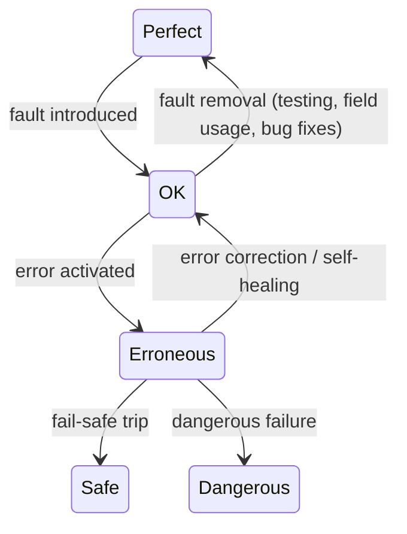

# SHIP Safety Case Approach — Bishop & Bloomfield (1995)

Paper from the EU SHIP project (Safety of Hazardous Industrial Plants). Presented at SafeComp95. Formalizes the concept of a "safety case" for systems containing both hardware and software, combining techniques from software verification and industrial plant safety.

## What is a safety case?

> "A documented body of evidence that provides a convincing and valid argument that a system is adequately safe for a given application in a given environment."

Built from three elements:
- **Claim**: a property asserted about the system or subsystem
- **Evidence**: the factual basis supporting the argument
- **Argument**: the logical chain linking evidence to the claim, governed by **inference rules**

## Argument types

Three categories, distinguished by their inference mechanism:

| Type | Evidence | Inference | Example |
|---|---|---|---|
| **Deterministic** | Axioms, formal models | Predicate logic / proof | "Protocol cannot deadlock" |
| **Probabilistic** | Failure rates, independence assumptions | Bayesian combination, Markov models, fault trees | "P(dangerous failure) < 10⁻⁶/yr" |
| **Qualitative** | Standards compliance, design rules, expert ratings | Acceptance criteria, tick-lists | "Conforms to IEC 61508" |

The overall argument should be **robust** — sound even if individual pieces contain errors or uncertainties.

## Hierarchical structure

Safety cases are structured as a hierarchy of claims. At any level, evidence can be:
- **Facts** — established scientific principles, prior research
- **Assumptions** — necessary for the argument but may not always hold (each has a probability of violation)
- **Sub-claims** — derived from lower-level sub-arguments with their own evidence

This is recursive: sub-claims at one level become the claims argued at the next level down. The structure evolves over the project lifetime — early sub-claims may be design targets, later replaced by facts or detailed sub-arguments.

**Consistency rule**: each argument tree should use a single consistent inference type, or explicitly transform between types at boundaries (e.g. a deterministic sub-argument feeds a zero-failure-rate into a probabilistic top-level argument).

## Defence in depth against uncertainty

Any argument chain can be wrong (flawed evidence, bad assumptions). The mitigation is to build **multiple independent argument chains** supporting the same claim, avoiding common links (shared assumptions). This way a single flaw doesn't collapse the entire case. More sophisticated versions quantify confidence in assumptions, common-mode failure probability, and per-chain claim limits.

## System failure behaviour model (fault-error-failure)

The paper adopts the standard **fault-error-failure** model. The key insight is that a system with a defect doesn't necessarily fail — it passes through a sequence of states, and at each transition there are opportunities for detection, recovery, or containment.

### States

| State | Meaning | Observable characteristics |
|---|---|---|
| **Perfect** | No faults exist in the system | Correct output for all possible inputs |
| **OK** (faulty) | Faults exist but have not been triggered | System operates correctly because the specific triggering input conditions have not been encountered. Indistinguishable from Perfect in normal operation |
| **Erroneous** | A fault has been activated — computed values deviate from design intent | The deviation may be transient ("glitch") or persistent. The system *may* self-heal if subsequent computations naturally correct the deviation, or explicit mechanisms (diversity, firewalls) detect and recover the correct value |
| **Safe** | The system has failed, but in a non-dangerous way | Fail-safe mechanisms override erroneous values with safe alternatives. The system may be degraded or stopped, but no hazard results |
| **Dangerous** | The system has failed in a way that creates a hazard | The erroneous state was not caught or contained, and the deviation was large enough and persistent enough to cause a dangerous outcome |

### Transitions

| Transition | Trigger | What determines probability |
|---|---|---|
| **Perfect → OK** | Fault introduced during development | Development process quality, procedures, documentation, design tools |
| **OK → Erroneous** | A latent fault is triggered by a specific input condition | Number of faults, fault size and distribution in the input space, operational profile (mode of use). A fault that is never triggered has zero "perceived size" |
| **Erroneous → OK** | Self-healing — subsequent computations naturally correct the glitch, or explicit error recovery mechanisms detect the deviation and restore correct values | Fault-tolerant design features (diversity, firewalls, redundancy), nature of the computation (some naturally damp errors) |
| **Erroneous → Safe** | Fail-safety — the system detects it cannot produce correct output and overrides with a safe alternative (e.g. shutdown, fallback to known-safe state) | Fail-safe design, what hazards exist, detection coverage |
| **Erroneous → Dangerous** | The deviation is large enough and persists long enough to cause a hazard, and no containment mechanism intervenes | Absence or failure of containment mechanisms, hazard severity |
| **OK → Perfect** (fault removal) | Testing reveals faults, field usage triggers and reports them, bug fixes are applied | Testing coverage, amount of field usage, bug reporting/correction processes. This is the basis of **reliability growth** — each version should contain fewer faults |

### Safety argument strategies per transition

Each transition arc maps to a different type of safety argument and evidence:

| Safety argument strategy | Target transition | Approach |
|---|---|---|
| **Fault elimination** | Maximize P(perfect state) | Good process, testing, formal methods, field history |
| **Error activation** | Minimize OK → erroneous | Test to expected usage, avoid known problem areas, avoid changes to input distribution |
| **Failure containment** | Strengthen erroneous → OK/safe | Fault-tolerant design, fail-safe design, fault injection testing |
| **Failure estimation** | Estimate OK → dangerous directly | Black-box reliability testing, operational failure reports, reliability growth models |

## Software failure model

Software reliability depends on three factors:
1. **Number of faults** in the code
2. **Size and location of faults** (in the input space)
3. **Input distribution** (operational profile)

Key insight: changing the input distribution can radically change the observed failure rate without changing the code. A fault that's never triggered by the operational profile has zero "perceived size." This means reliability claims are always *relative to a usage profile*.

Over time, faults are discovered and corrected → reliability growth. The same model applies to hardware design faults (as opposed to random wear-out failures).

## Practical examples

### Nuclear pressure vessel
Safety case maps onto the state-transition model. Key arguments: cracks can't grow to catastrophic failure fast enough (deterministic, from fracture mechanics), plus two independent containment mechanisms (periodic inspection + online leak detection). Field experience provides a separate argument leg.

### Boiler system control
Deterministic argument via formal specification in Temporal Logic Algebra. Safety constraints (water level within bounds) are modeled and proven. Probabilistic arguments cover random hardware failures. Successive design iterations address additional component failure modes. Assumptions are explicit — their violation probability can be computed to bound dangerous failure rate.

### Industrial controller field data
Small controllers: fault fixes peak in year 1, drop to near-zero by year 2 — effectively "perfect" after initial correction. Later peaks correlate with new feature additions (new faults introduced).
Large controllers: steady fault-fix rate across years — more complex, fewer units sold (slower fault discovery), more scope for new-feature-introduced faults.

## Relevance to process mining and sensor-based event detection

### The state-transition model as a process model

The failure behaviour model (Perfect → OK → Erroneous → Dangerous/Safe) is itself a **process** with discrete state transitions. If sensor telemetry can detect these transitions, change-point detection becomes a mechanism for generating events that trace a system's path through its safety states. Each detected change point maps to a transition arc in the safety model.

### Classifying detected events as safety states

Change-point detection (Guralnik) produces events — but each event is just "the signal changed here." The fault-error-failure model provides a **classification scheme** that gives each event a safety-relevant label:

| Detected change pattern | Safety state classification | Event label |
|---|---|---|
| Signal shifts from nominal operating range to deviation | **OK → Erroneous** | Error activation |
| Deviation self-corrects or is corrected back to nominal | **Erroneous → OK** | Self-healing / error recovery |
| System enters degraded-but-safe mode (e.g. shutdown, fallback) | **Erroneous → Safe** | Safe failure / fail-safe trip |
| Deviation escalates beyond safety thresholds | **Erroneous → Dangerous** | Dangerous failure |
| Post-maintenance signal returns to baseline after fault removal | **OK → Perfect** (via fault removal) | Reliability improvement |

The Guralnik algorithm's piecewise model fitting provides the mechanism: the model *before* and *after* each change point characterizes the nature of the transition. Domain knowledge (or the safety case structure itself) maps model-change signatures to state transitions. For example, in the nuclear pressure vessel case: a change from stable temperature readings to an increasing trend might indicate crack growth (OK → Erroneous), while an automated reactor trip would be Erroneous → Safe.

### Classifying transitions using social network analysis

Once events are classified into safety-state transitions and assigned to cases (system instances) and performers (subsystems/sensors), social network analysis reveals **how failures propagate across subsystems**:

**Handover-of-work as failure propagation.** If subsystem A's error activation event is directly followed by subsystem B's error activation event (in the same case), this is a handover-of-work in the van der Aalst sense — but here it means A's failure *triggered* B's failure. The causality-based metrics (direct succession, with β decay for indirect succession) quantify how tightly coupled subsystems are in failure propagation.

**Subcontracting as cascading failures.** If the pattern is A → B → A (A fails, triggers B, which triggers A again), this is the subcontracting metric — and in safety terms it represents a **feedback loop** in the failure chain. These are particularly dangerous because they can amplify errors.

**Joint cases as common-cause failure.** If two subsystems frequently appear in the same failure cases (the working-together metric), this suggests **common-cause failure** — they share a vulnerability (common input, shared dependency, common environment). This directly undermines the "independent argument chains" assumption in the safety case.

**Performer-by-activity matrix for failure profiles.** Each subsystem (performer) has a profile of which transitions it participates in. Subsystems with similar failure profiles (measured via Hamming/Pearson distance) may share design weaknesses or operational vulnerabilities, even if they don't directly interact.

### Quantifying transition probabilities from event logs

If events are reliably detected and classified into state transitions, the event log becomes a direct source of **transition probability estimates** for the safety case. Process mining on these logs could:
- Estimate the rate of OK → Erroneous transitions (error activation rate)
- Measure the effectiveness of containment (what fraction of erroneous states recover vs. become dangerous)
- Track reliability growth over time (decreasing fault discovery rate)
- Detect deviations from expected process behaviour (e.g. an unexpected increase in error activation events after a software update)
- Validate independence assumptions: if the social network shows strong causal coupling between subsystems that the safety case assumes are independent, the safety case has a gap

### Defence in depth as a process mining validation criterion

The paper's emphasis on **independent argument chains** suggests a validation criterion for process mining results: if the same safety-critical event is detected by multiple independent sensor channels (analogous to independent argument chains), confidence in the event is higher. This connects to the wavelet analysis idea of cross-scale stability — events that appear at multiple wavelet scales are more likely real, just as safety claims supported by multiple independent argument chains are more robust.
