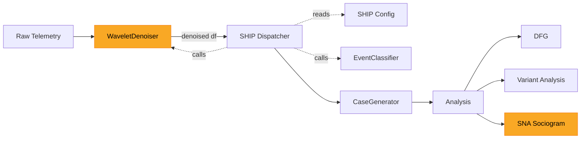
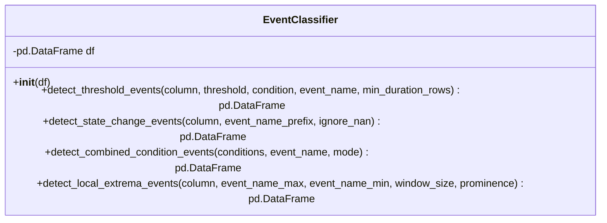
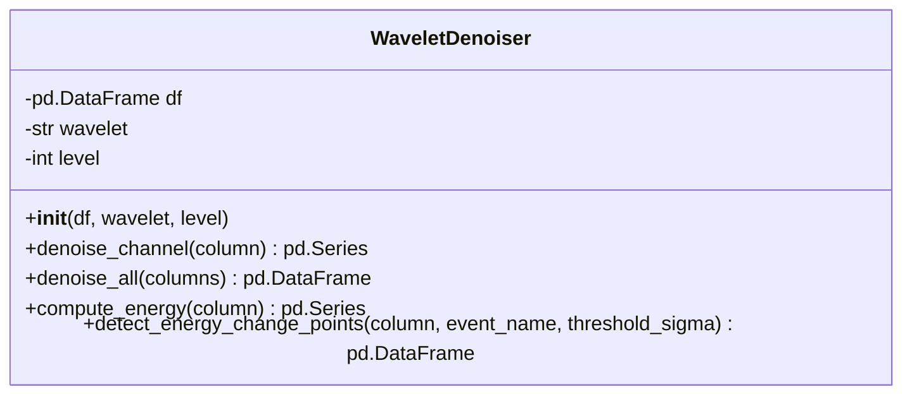

# Overview

This project will take the FSAE data, classify events using a config-driven dispatcher that adheres to the SHIP safety model, then perform process mining analysis to construct event failure graphs. A wavelet denoising step and SNA sociogram are stretch goals.

## Pipeline



**Legend**: Yellow nodes are stretch goals. Base pipeline runs without them — raw telemetry feeds directly into the SHIP dispatcher (no denoising, no energy-based change detection), and analysis covers DFG and Variant Analysis (no SNA).

## Design

### EventClassifier (reuse from example_4)

Stateless detection methods for extracting discrete events from a DataFrame column. Provides threshold detection, state change detection, combined conditions, and local extrema detection. These methods are the building blocks called by the SHIP dispatcher. They have no knowledge of SHIP or subsystems. Refer to `examples/example_4/event_extractor.py` for the existing implementation.



### SHIP Config

A flat list of event definitions. Each entry maps a detection method call to a subsystem and SHIP transition type. No class hierarchy — adding or changing events is a config edit.

Events that have both activation and recovery use `detect_state_change_events` on a derived boolean column. The dispatcher pre-computes the boolean (e.g. `df["f88.ect1_°f"] > 220`), injects it as a temporary column, and runs state-change detection against it. The dispatcher constructs the `False->True` / `True->False` activity keys programmatically from the `event_name_prefix` in `args` — the config author never writes these strings by hand. The resulting transitions are mapped to `error_activation` and `error_recovery` automatically. Events with only a single transition (e.g. one-shot threshold crossings, combined conditions) use the simpler `transition_type` field.

```python
SHIP_EVENTS = [
    # State-change pattern: one detection, two SHIP transitions.
    # The dispatcher builds the transition mapping from event_name_prefix —
    # "{prefix} False->True" → error_activation,
    # "{prefix} True->False" → error_recovery.
    {
        "subsystem": "Engine",
        "method": "detect_state_change_events",
        "derived_column": ("f88.ect1_°f", ">", 220),
        "args": {
            "event_name_prefix": "engine_temp",
        },
    },
    # Simple pattern: one detection, one SHIP transition
    {
        "subsystem": "Lubrication",
        "transition_type": "error_activation",
        "method": "detect_threshold_events",
        "args": {
            "column": "f88.oil.p1_psi",
            "threshold": 15,
            "condition": "<",
            "event_name": "low_oil_pressure",
        },
    },
    # ... one entry per event
]
```

### SHIP Dispatcher

A single function that iterates over `SHIP_EVENTS`, calls the corresponding `EventClassifier` method, tags results with `subsystem` and `transition_type`, and concatenates into one event log. Handles two config shapes: entries with `derived_column` (state-change pattern) compute a boolean series and build the transition mapping programmatically from the `event_name_prefix`; entries with `transition_type` (simple pattern) tag all results uniformly.

For derived-column entries, the dispatcher injects the boolean series as a uniquely-named temporary column on a per-entry copy, avoiding mutation of the shared DataFrame and naming collisions between entries. The `EventClassifier` is constructed once from the original DataFrame; derived entries get their own instance. If a `WaveletDenoiser` is provided (stretch goal), the dispatcher routes `detect_energy_change_points` calls to it instead of `EventClassifier`.

```python
def dispatch_ship_events(
    df: pd.DataFrame, config: list[dict], wd: WaveletDenoiser | None = None,
) -> pd.DataFrame:
    ec = EventClassifier(df)
    frames = []
    for entry in config:
        if "derived_column" in entry:
            # Compute boolean series without mutating the shared df
            col, op, val = entry["derived_column"]
            ops = {">": gt, "<": lt, ">=": ge, "<=": le, "==": eq}
            derived = ops[op](df[col], val)
            # Inject as a temp column on a shallow copy for this entry only
            entry_df = df.copy(deep=False)
            temp_col = f"_derived_{entry['args']['event_name_prefix']}"
            entry_df[temp_col] = derived
            entry_ec = EventClassifier(entry_df)
            args = {**entry["args"], "column": temp_col}
            events = getattr(entry_ec, entry["method"])(**args)
            # Build transition mapping from the prefix
            prefix = entry["args"]["event_name_prefix"]
            tmap = {
                f"{prefix} False->True": "error_activation",
                f"{prefix} True->False": "error_recovery",
            }
            events["transition_type"] = events["activity"].map(tmap)
            events = events.dropna(subset=["transition_type"])
        else:
            # Route to WaveletDenoiser or EventClassifier based on method name
            target = wd if wd and hasattr(wd, entry["method"]) else ec
            events = getattr(target, entry["method"])(**entry["args"])
            events["transition_type"] = entry["transition_type"]

        events["subsystem"] = entry["subsystem"]
        frames.append(events)
    return pd.concat(frames, ignore_index=True).sort_values("timestamp")
```

Output DataFrame columns: `timestamp`, `activity`, `subsystem`, `transition_type`, `value`.

### CaseGenerator (reuse from example_4)

Time-window method that takes an event of interest (EoI) and constructs a trace from the events before (`time_before`) and after (`time_after`). Both `time_before` and `time_after` must be greater than 0. The `subsystem` and `transition_type` columns from the dispatcher output are passed through to the case output. The `subsystem` column is mapped to PM4Py's `org:resource` field to enable SNA metric computation. Refer to `examples/example_4/case_generator.py`.

### WaveletDenoiser (stretch goal)



Handles both signal cleaning and structural change detection using a single wavelet decomposition, eliminating the need for the `ruptures` library.

**Denoising.** Decompose each channel with `pywt.wavedec()`, threshold small detail coefficients with `pywt.threshold()`, and reconstruct with `pywt.waverec()`. Returns a cleaned DataFrame with the same shape as the input.

**Coefficient energy.** `compute_energy()` computes a windowed energy profile from the wavelet detail coefficients. For each decomposition level, square the detail coefficients and sum them within a sliding window to produce a time-aligned energy series. Spikes in this series indicate regions where the signal's frequency content changes — structural transitions rather than simple threshold crossings.

**Energy-based change detection.** `detect_energy_change_points()` thresholds the energy profile (e.g. energy > mean + `threshold_sigma` * std) and emits events at the rising edges. This replaces the `ruptures`-based `detect_change_points()` approach: same goal (find structural signal changes without manual thresholds), but reuses the wavelet decomposition already computed for denoising and avoids an external dependency. The output DataFrame matches the `EventClassifier` format (`timestamp`, `activity`, `value`).

**Subsystem assignment.** Energy change events are registered in `SHIP_EVENTS` like any other detector — the config entry specifies `subsystem`, `transition_type`, and `method: "detect_energy_change_points"`. The dispatcher calls the method on a `WaveletDenoiser` instance instead of `EventClassifier` when the method name belongs to the denoiser. This keeps subsystem ownership in the config (where all other assignments live) rather than in notebook glue code or a separate channel-to-subsystem lookup.

```python
# Energy change detection entries in SHIP_EVENTS (stretch goal)
{
    "subsystem": "Engine",
    "transition_type": "error_activation",
    "method": "detect_energy_change_points",
    "args": {
        "column": "f88.ect1_°f",
        "event_name": "engine_temp_energy_change",
        "threshold_sigma": 3.0,
    },
},
```

## Implementation

### Step 1: EventClassifier ✓

`event_classifier.py` — `EventExtractor` renamed to `EventClassifier`; `detect_change_points()` (ruptures) removed. One behavioral addition: `detect_state_change_events` checks `pd.api.types.is_bool_dtype()` and formats boolean transitions as `"False->True"` / `"True->False"` rather than `"0->1"` / `"1->0"`. This is required for the dispatcher's `tmap` lookup to work on derived boolean columns. All `shift(1).fillna(False)` calls replaced with `shift(1, fill_value=False)` to avoid a pandas FutureWarning on object-dtype boolean series.

### Step 2: SHIP Config ✓

`ship_config.py` — 16 entries across 6 subsystems. All thresholds calibrated from data (190,587 rows × 76 columns). See the **Data Notes** section for the findings that drove each calibration decision.

### Step 3: SHIP Dispatcher ✓

`ship_dispatcher.py` — implemented as designed. Two additions beyond the spec:
- Missing columns are skipped with a `warnings.warn()` call rather than raising, so a partial config runs without crashing on channels absent from a given dataset.
- A `KNOWN ISSUE` comment documents the heterogeneous `value` dtype problem (bool/float/NaN mixing across detector methods triggers a pandas FutureWarning on `pd.concat`). Current behavior is correct. Future fix: `_validate_event_frame()` helper or pandera schema that casts `value` to `float64` before appending.

### Step 4: CaseGenerator ✓

Reused unchanged from `examples/example_4/case_generator.py`. The `subsystem` and `transition_type` columns are preserved through the `window_events = self.event_log[in_window].copy()` call with no modifications needed.

### Step 5: Analysis ✓

`example_5.ipynb` — full pipeline notebook. Sections: data loading, threshold calibration table, SHIP dispatch, event timeline plot, case generation, PM4Py event log prep, DFG (frequency + performance), variant analysis (chevron), subsystem-filtered DFG, and a stretch-goal appendix cell for the WaveletDenoiser.

**WaveletDenoiser (stretch goal)** — `wavelet_denoiser.py` — implemented but not wired into the base pipeline. The appendix cell in the notebook shows how to connect it. Requires `pip install PyWavelets`.

**SNA Sociogram (stretch goal)** — not yet implemented. The `org:resource` mapping (`subsystem` → `org:resource`) is already applied in the notebook's PM4Py prep step, so PM4Py's SNA functions can be called directly on the event log without further changes.

## Subsystem Definitions

| Subsystem | Channels |
|---|---|
| **Suspension** | `fl/fr/rl/rr.shock_mm`, `*.shock.pos.zero_mm`, `*.shock.speed_mm/s`, `fl.shock.accel_mm/s/s`, `*.bumpstop_unit` |
| **Brakes** | `front.brake_psi`, `rear.brake_psi` |
| **Engine** | `f88.rpm_rpm`, `f88.map1_mbar`, `f88.tps1_%`, `f88.lambda1_a/f`, `f88.act1_°f`, `f88.ect1_°f`, `f88.gear_#`, `f88.cal.switch_#`, `f88.baro.pr_mbar` |
| **Fuel** | `f88.fuel.pr1_psi`, `f88.fuel.t_°f`, `fuel flow_cc/min`, `fuel used_liters`, `injector duty_%` |
| **Lubrication** | `f88.oil.p1_psi`, `run.oil.pres_psi`, `run.oil.pres.hi_psi`, `load.oil.pres_psi`, `load.oil.pres.hi_psi`, `load.oil.pres.hi2_psi` |
| **Electrical** | `battery_v`, `f88.v batt_v` |
| **Vehicle Dynamics** | `acc.lateral_g`, `acc.longitudin_g`, `roll angle_unit`, `fr.roll.gradient_degree`, `re.roll.gradient_degree`, `force_unit`, `kw_unit` |
| **Drivetrain** | `f88.v.speed_mph`, `f88.d.speed_mph`, `f88.speed.fl/fr/rl/rr_mph` |
| **GPS** | `gps.speed_mph`, `gps.nsat_#`, `gps.latacc_g`, `gps.lonacc_g`, `gps.slope_deg`, `gps.heading_deg`, `gps.gyro_deg/s`, `gps.altitude_m`, `gps.posaccuracy_m`, `gps.latitude_°`, `gps.longitude_°`, `gps.elevation_cm` |
| **Datalogger** | `datalogger.tem_°f`, `aim.time_s`, `cycle time_ms`, `aim.distancemeters_m` |

## SHIP Event Mapping

### Suspension

| Transition | Event | Detection |
|---|---|---|
| error_activation | Bumpstop hit | `*.bumpstop_unit` crosses threshold |
| error_activation | Bottoming event | Shock position exceeds travel limit |
| error_activation | Roll event | Roll angle/gradient exceeds threshold |

### Brakes

| Transition | Event | Detection |
|---|---|---|
| error_activation | Wheel lockup | Wheel speed drops to zero while vehicle speed > 0 (combined condition) |

### Engine

| Transition | Event | Detection |
|---|---|---|
| error_activation | Engine overheating | State change on `f88.ect1_°f > threshold` (False→True) |
| error_recovery | Cooling recovery | State change on `f88.ect1_°f > threshold` (True→False) |
| error_activation | Lugging | Low RPM + high throttle (combined condition) |

### Lubrication

| Transition | Event | Detection |
|---|---|---|
| error_activation | Low oil pressure | State change on `f88.oil.p1_psi < threshold` (False→True) |
| error_recovery | Oil pressure recovery | State change on `f88.oil.p1_psi < threshold` (True→False) |
| error_activation | Oil pressure spike | State change on `f88.oil.p1_psi > upper_threshold` (False→True) |
| error_recovery | Oil pressure spike recovery | State change on `f88.oil.p1_psi > upper_threshold` (True→False) |

### Electrical

| Transition | Event | Detection |
|---|---|---|
| error_activation | Low battery voltage | State change on `battery_v < threshold` (False→True) |
| error_recovery | Battery voltage recovery | State change on `battery_v < threshold` (True→False) |
| error_activation | GPS lock lost | State change on `gps.nsat_# < minimum` (False→True) |
| error_recovery | GPS lock regained | State change on `gps.nsat_# < minimum` (True→False) |

### Drivetrain

| Transition | Event | Detection |
|---|---|---|
| error_activation | Wrong gear | RPM/speed ratio outside expected range for current gear (combined condition) |
| error_activation | Shift under load | Gear change while throttle > threshold (combined condition + state change) |

### Operational events (not SHIP-classified)

These events describe normal operation or session context. They are useful as trigger events for the `CaseGenerator` but do not represent safety-state transitions.

- **Lap**: lap started, lap completed, sector crossing
- **Driver performance**: braking event, cornering event, throttle event
- **Gear shifts**: upshift, downshift
- **Engine**: launch
- **Calibration**: calibration switch change, map change
- **Track position**: straight section, technical section, elevation change
- **Session**: fastest sector, lap consistency

## Data Notes

Observations from exploring `FSAE_Endurance_Full_parsed.csv` (190,587 rows, 100 Hz, ~31 min endurance session).

### Channel availability

- **`roll angle_unit`** — always `0.0`. Channel is present but unpopulated in this dataset. The roll event config entry is retained for completeness but will produce zero events.
- **`f88.v batt_v`** — listed in the Electrical subsystem definition but this exact column name was not found in the parsed CSV. `battery_v` (without the `f88.v` prefix) is what exists and is used instead.

### Key channel distributions and threshold decisions

| Channel | Min | Mean | Max | p95 | Threshold used | Rationale |
|---|---|---|---|---|---|---|
| `f88.ect1_°f` (coolant temp) | 0 | 148 °F | 169 °F | 164 °F | **> 160 °F** | Max is only 169 °F — 220 °F design spec never fires. 160 °F sits above the 90th pct (163 °F) and catches the true high-temp tail. |
| `f88.oil.p1_psi` (oil pressure) | −0.8 | 30.7 | 90.6 | — | **< 5 psi** (low), **> 80 psi** (spike) | Pressure drops heavily during idle/startup (28% of rows below 15 psi) — a 15 psi threshold would flood the event log. 5 psi separates genuinely dangerous low-pressure from normal low-RPM drop. Upper bound 80 psi catches anomalous spikes near the observed max. |
| `battery_v` (battery voltage) | 12.9 | 13.9 | 15.0 | — | **< 13.2 V** | Alternator keeps voltage very stable (std = 0.43 V). The 11.5 V design spec never fires. 13.2 V (below the 1st percentile) catches brief sag events. |
| `gps.nsat_#` (GPS satellites) | 7 | — | 11 | — | **< 8** | Range is 7–11 sat. The design spec threshold of 4 never fires; < 8 catches the observed minimum (7 sat) as a degradation event. |
| `fl.bumpstop_unit` | 0 | 0.35 | 5.0 | 5.0 | **> 0.0** | Channel is binary in practice: either 0 (no contact) or 5 (hard contact). Any non-zero value means the bumpstop is engaged. Same pattern holds for fr/rl/rr. |
| `f88.rpm_rpm` | 0 | — | 12,827 | — | **> 12,000 at speed > 30 mph** | 10,000 RPM at speed produced 847 matching rows — normal operation at full throttle. Raised to 12,000 to target near-limiter excursions. |

### Observed event counts (base pipeline run)

| Subsystem | error_activation | error_recovery | Total |
|---|---|---|---|
| Suspension | 72 | 72 | 144 |
| Brakes | 3 | 0 | 3 |
| Engine | 45 | 44 | 89 |
| Lubrication | 274 | 274 | 548 |
| Electrical | 7 | 7 | 14 |
| Drivetrain | 3 | 0 | 3 |
| **Total** | **404** | **397** | **801** |

404 trigger events → 404 cases → 10,727 event-case assignments (avg 26.6 events/case) with a 10 s pre-trigger / 30 s post-trigger window.

### Channels not implemented

The following events from the SHIP Event Mapping are not in the current config due to implementation complexity or missing threshold data:

- **Bottoming event** — shock position data (`*.shock.pos.zero_mm`) requires knowing each corner's physical travel limit, which is not in the dataset metadata.
- **Wrong gear** — gear-ratio-to-RPM/speed mapping requires transmission specifications not available in the telemetry file.
- **Shift under load** — requires detecting gear-change events conditioned on simultaneous throttle position; the current `detect_combined_condition_events` signature can't express this (it AND/OR conditions on the same timestamp, not sequential events).

## Risks

### Implementation

- **Threshold calibration required.** ~~Events and detection methods are defined, but specific threshold values and detection parameters need to be determined from the data.~~ Done — see Data Notes above. Thresholds should be re-validated if a different session or car configuration is used.
- **Not all SHIP transitions are populated.** Failsafe trip and dangerous failure events are empty — these may not be observable in this dataset if no actual failures occurred during the endurance run. Error recovery is now captured automatically via the state-change pattern (every boolean threshold that activates also produces a recovery when the condition clears).

### Future work

- **Wavelet parameters have no selection method.** The `WaveletDenoiser` requires a wavelet basis and decomposition level, but there is no guidance on how to choose them for this dataset. Incorrect parameters could over-denoise (removing real transients) or under-denoise (leaving noise that generates false events). The energy threshold (`threshold_sigma`) for change detection is similarly data-dependent — too sensitive and noise produces false change points, too conservative and real transitions are missed.
- **SHIP classification is manually defined, not detected.** Transition types are encoded as static rules chosen upfront. If a transition is misclassified (e.g. normal variance labeled as error activation), all downstream analysis inherits that error. A validation step or feedback mechanism could address this.
- **Time-window sizing is unresolved.** The `CaseGenerator` window parameters directly determine which events appear in each case. Too small and propagation chains are missed; too large and unrelated events appear causally linked. Sensitivity analysis across window sizes would mitigate this.
- **Event volume vs. graph interpretability.** Multiple subsystems with multiple detectors across four transition types can produce dense event logs. The resulting DFGs and sociograms may be too complex to interpret without filtering or aggregation strategies.
- **No ground truth or validation approach.** The pipeline will always produce some graph — there is no mechanism to verify whether edges represent real failure propagation or coincidental co-occurrence within time windows.
- **`value` dtype inconsistency.** `EventClassifier` methods return heterogeneous value dtypes (bool from state-change on derived columns, float from threshold events, NaN from combined conditions). This causes a pandas `FutureWarning` on `pd.concat`. Fix is a `_validate_event_frame()` helper or pandera schema that casts `value` to `float64` before concatenation in the dispatcher.
- **`roll angle_unit` is unpopulated.** The channel exists in the parsed CSV but is always zero. If roll data is needed, it may need to be derived from accelerometer channels (`acc.lateral_g`) or sourced from a different data file.
- **Lubrication dominates the event log.** Oil pressure (274 activations + 274 recoveries = 548 events, 68% of total) can drown out rarer subsystem interactions in the DFG. Consider filtering by subsystem or increasing the threshold before running variant analysis.
