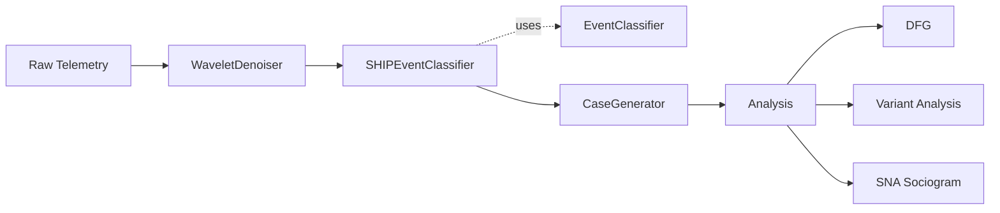
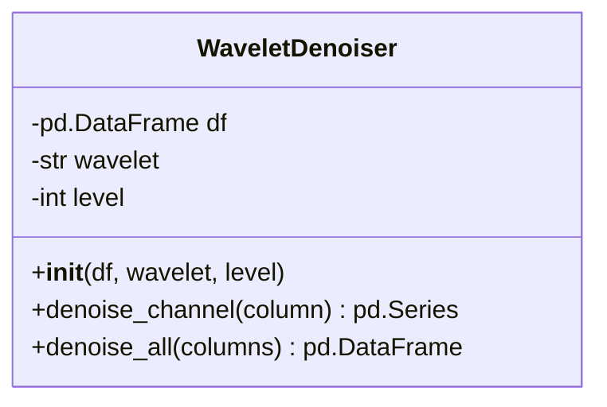
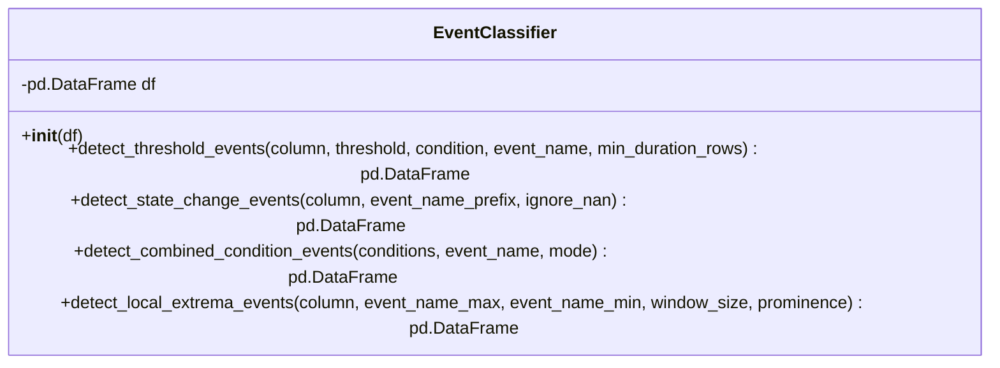
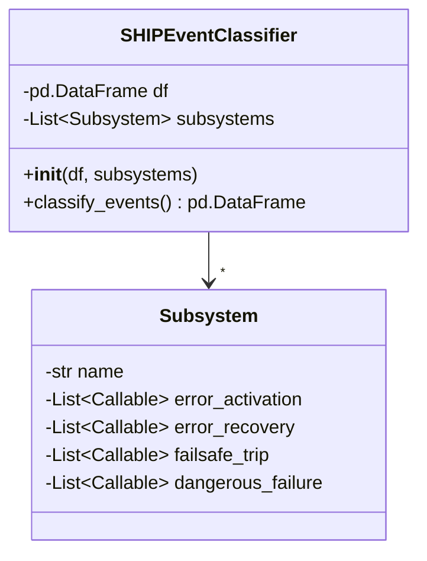
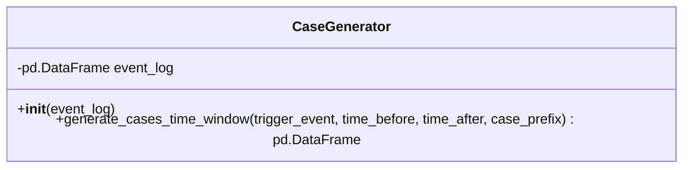

# Overview

This project will take the FSAE data, apply a wavelet denoising function across the time-series data, classify events using an event extractor that adheres to the SHIP safety model, then perform social network analysis (SNA) to construct event failure graphs.

## Pipeline

## Class Diagrams

### WaveletDenoiser

### EventClassifier

### SHIPEventClassifier

### CaseGenerator

## Implementation

### Step 1: WaveletDenoiser

Apply wavelet denoising to clean raw sensor channels before event detection. Decompose each channel with `pywt.wavedec()`, threshold small coefficients with `pywt.threshold()`, and reconstruct with `pywt.waverec()`. Returns a cleaned DataFrame with the same shape as the input.

### Step 2: EventClassifier

Stateless detection methods for extracting discrete events from a DataFrame column. Provides threshold detection, state change detection, combined conditions, and local extrema detection. These methods are the building blocks — they are called by the `SHIPEventClassifier` but have no knowledge of SHIP or subsystems. Refer to `examples/example_4/event_extractor.py` for the existing implementation.

### Step 3: SHIPEventClassifier

Models the system as a collection of `Subsystem` objects. Each `Subsystem` has a name and four lists of callables — one per SHIP transition type (`error_activation`, `error_recovery`, `failsafe_trip`, `dangerous_failure`). Each callable is a bound `EventClassifier` method (e.g. `lambda ec: ec.detect_threshold_events("coolant_temp", 100, ">", "coolant_high")`). The `classify_events()` method iterates over subsystems, calls each detection function, and tags the resulting events with the subsystem name and transition type.

Output DataFrame columns: `timestamp`, `activity`, `subsystem`, `transition_type`, `value`.

### Step 4: CaseGenerator

Time-window method that takes an event of interest (EoI) and constructs a trace from the events before (`time_before`) and after (`time_after`). Both `time_before` and `time_after` must be greater than 0. The `subsystem` and `transition_type` columns from the `SHIPEventClassifier` output are passed through to the case output. The `subsystem` column is mapped to PM4Py's `org:resource` field to enable SNA metric computation. Refer to `examples/example_4/case_generator.py`.

### Step 5: Analysis

- **DFG Analysis**: Directly-Follows Graphs showing event ordering, timing, and transition counts. Refer to `examples/example_4/example_4_part_2.ipynb`.
- **Variant Analysis**: Identify unique event sequences across cases. Refer to `examples/example_4/example_4_part_2.ipynb`.
- **SNA Sociogram**: Map subsystems to performers, SHIP transition types to activities, and failure instances to cases. Compute handover-of-work (failure propagation), subcontracting (feedback loops), working-together (common-cause failure), and performer-by-activity similarity (shared failure profiles). Filter the sociogram by transition type to answer targeted safety questions.

## Risks

### Critical

- **Subsystem definitions are undefined.** The pipeline architecture is in place but the actual subsystems for the FSAE dataset — which sensors map to which subsystems, and which callables define each transition type — have not been specified. Without these, the `SHIPEventClassifier` cannot be instantiated.
- **Wavelet parameters have no selection method.** The `WaveletDenoiser` requires a wavelet basis and decomposition level, but there is no guidance on how to choose them for this dataset. Incorrect parameters could over-denoise (removing real transients) or under-denoise (leaving noise that generates false events), undermining every downstream step.

### Future work

- **SHIP classification is manually defined, not detected.** Transition types are encoded as static rules chosen upfront. If a transition is misclassified (e.g. normal variance labeled as error activation), all downstream analysis inherits that error. A validation step or feedback mechanism could address this.
- **Time-window sizing is unresolved.** The `CaseGenerator` window parameters directly determine which events appear in each case. Too small and propagation chains are missed; too large and unrelated events appear causally linked. Sensitivity analysis across window sizes would mitigate this.
- **Event volume vs. graph interpretability.** Multiple subsystems with multiple detectors across four transition types can produce dense event logs. The resulting DFGs and sociograms may be too complex to interpret without filtering or aggregation strategies.
- **No ground truth or validation approach.** The pipeline will always produce some graph — there is no mechanism to verify whether edges represent real failure propagation or coincidental co-occurrence within time windows.
