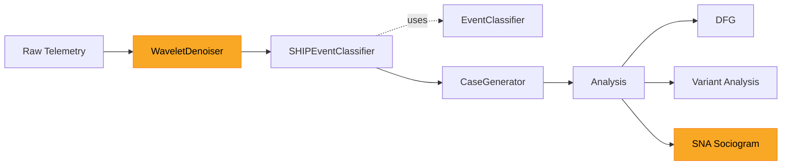
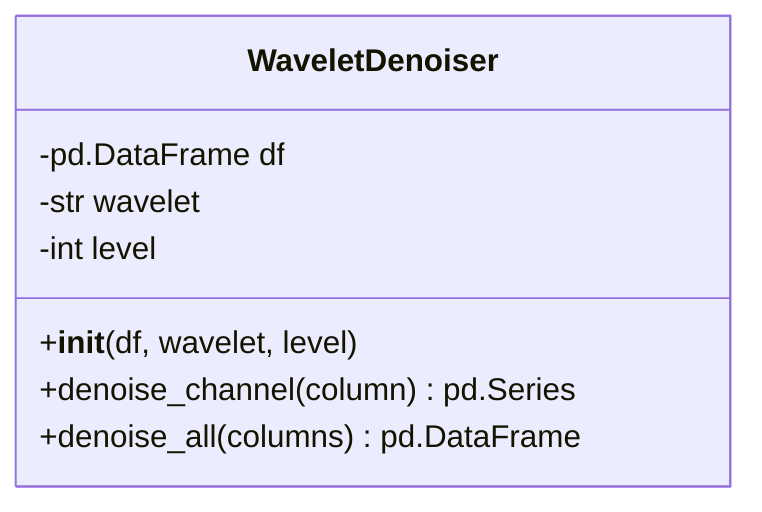
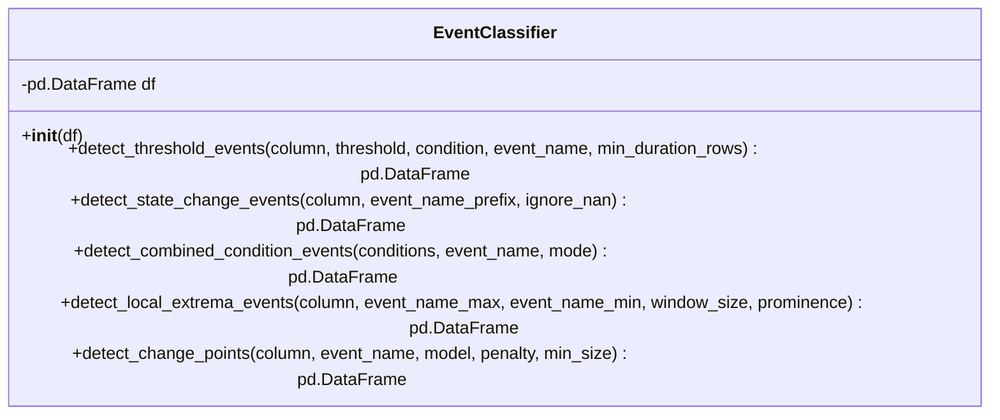
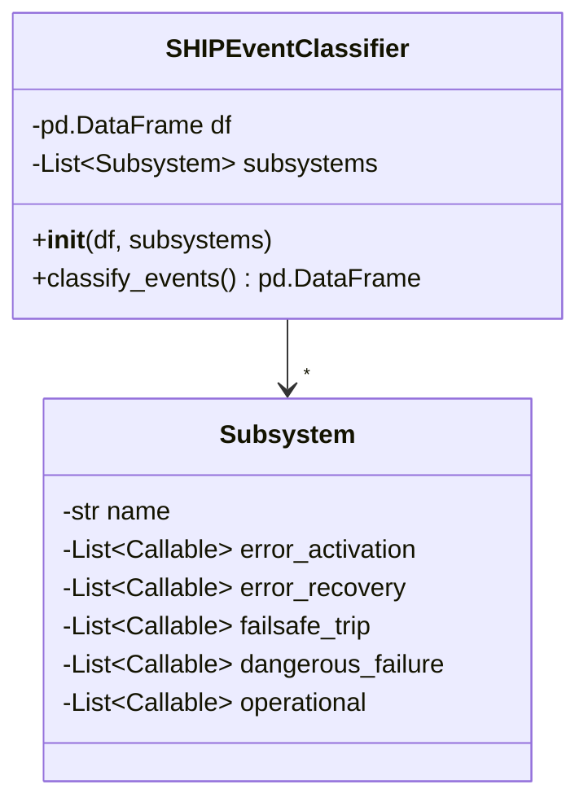
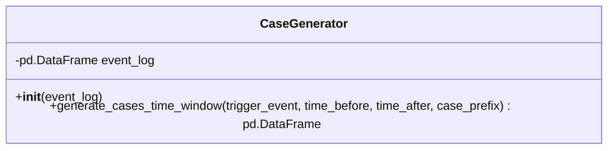

# Overview

This project will take the FSAE data, apply a wavelet denoising function across the time-series data, classify events using an event extractor that adheres to the SHIP safety model, then perform social network analysis (SNA) to construct event failure graphs.

## Pipeline

**Legend**: Yellow nodes are stretch goals. Base pipeline runs without them — raw telemetry feeds directly into `SHIPEventClassifier` (no denoising), and analysis covers DFG and Variant Analysis (no SNA).

## Class Diagrams

### WaveletDenoiser

### EventClassifier

### SHIPEventClassifier

### CaseGenerator

## Implementation

### Step 1: WaveletDenoiser (stretch goal)

Apply wavelet denoising to clean raw sensor channels before event detection. Decompose each channel with `pywt.wavedec()`, threshold small coefficients with `pywt.threshold()`, and reconstruct with `pywt.waverec()`. Returns a cleaned DataFrame with the same shape as the input.

### Step 2: EventClassifier

Stateless detection methods for extracting discrete events from a DataFrame column. Provides threshold detection, state change detection, combined conditions, and local extrema detection. As a stretch goal, a `detect_change_points()` method wraps the `ruptures` library (`Pelt` search with configurable cost model and penalty) to detect structural signal changes without manual thresholds. These methods are the building blocks — they are called by the `SHIPEventClassifier` but have no knowledge of SHIP or subsystems. Refer to `examples/example_4/event_extractor.py` for the existing implementation.

### Step 3: SHIPEventClassifier

Models the system as a collection of `Subsystem` objects. Each `Subsystem` has a name, four lists of callables for SHIP transition types (`error_activation`, `error_recovery`, `failsafe_trip`, `dangerous_failure`), and an `operational` list for normal operation events (e.g. gear shifts, braking events, lap crossings). Each callable is a bound `EventClassifier` method (e.g. `lambda ec: ec.detect_threshold_events("coolant_temp", 100, ">", "coolant_high")`). The `classify_events()` method iterates over subsystems, calls each detection function, and tags the resulting events with the subsystem name and transition type. Operational events are tagged with `transition_type="operational"` — they flow through the pipeline for DFG context and as `CaseGenerator` triggers but are excluded from SNA failure propagation analysis.

Output DataFrame columns: `timestamp`, `activity`, `subsystem`, `transition_type`, `value`.

### Step 4: CaseGenerator

Time-window method that takes an event of interest (EoI) and constructs a trace from the events before (`time_before`) and after (`time_after`). Both `time_before` and `time_after` must be greater than 0. The `subsystem` and `transition_type` columns from the `SHIPEventClassifier` output are passed through to the case output. The `subsystem` column is mapped to PM4Py's `org:resource` field to enable SNA metric computation. Refer to `examples/example_4/case_generator.py`.

### Step 5: Analysis

- **DFG Analysis**: Directly-Follows Graphs showing event ordering, timing, and transition counts. Refer to `examples/example_4/example_4_part_2.ipynb`.
- **Variant Analysis**: Identify unique event sequences across cases. Refer to `examples/example_4/example_4_part_2.ipynb`.
- **SNA Sociogram (stretch goal)**: Map subsystems to performers, SHIP transition types to activities, and failure instances to cases. Compute handover-of-work (failure propagation), subcontracting (feedback loops), working-together (common-cause failure), and performer-by-activity similarity (shared failure profiles). Filter the sociogram by transition type to answer targeted safety questions.

## Subsystem Definitions

| Subsystem | Channels |
|---|---|
| **Suspension** | `fl/fr/rl/rr.shock_mm`, `*.shock.pos.zero_mm`, `*.shock.speed_mm/s`, `fl.shock.accel_mm/s/s`, `*.bumpstop_unit` |
| **Brakes** | `front.brake_psi`, `rear.brake_psi` |
| **Engine** | `f88.rpm_rpm`, `f88.map1_mbar`, `f88.tps1_%`, `f88.lambda1_a/f`, `f88.act1_°f`, `f88.ect1_°f`, `f88.gear_#`, `f88.cal.switch_#`, `f88.baro.pr_mbar` |
| **Fuel** | `f88.fuel.pr1_psi`, `f88.fuel.t_°f`, `fuel flow_cc/min`, `fuel used_liters`, `injector duty_%` |
| **Lubrication** | `f88.oil.p1_psi`, `run.oil.pres_psi`, `run.oil.pres.hi_psi`, `load.oil.pres_psi`, `load.oil.pres.hi_psi`, `load.oil.pres.hi2_psi` |
| **Electrical** | `battery_v`, `f88.v batt_v` |
| **Vehicle Dynamics** | `acc.lateral_g`, `acc.longitudin_g`, `roll angle_unit`, `fr.roll.gradient_degree`, `re.roll.gradient_degree`, `force_unit`, `kw_unit` |
| **Drivetrain** | `f88.v.speed_mph`, `f88.d.speed_mph`, `f88.speed.fl/fr/rl/rr_mph` |
| **GPS** | `gps.speed_mph`, `gps.nsat_#`, `gps.latacc_g`, `gps.lonacc_g`, `gps.slope_deg`, `gps.heading_deg`, `gps.gyro_deg/s`, `gps.altitude_m`, `gps.posaccuracy_m`, `gps.latitude_°`, `gps.longitude_°`, `gps.elevation_cm` |
| **Datalogger** | `datalogger.tem_°f`, `aim.time_s`, `cycle time_ms`, `aim.distancemeters_m` |

## SHIP Event Mapping

### Suspension

| Transition | Event | Detection |
|---|---|---|
| error_activation | Bumpstop hit | `*.bumpstop_unit` crosses threshold |
| error_activation | Bottoming event | Shock position exceeds travel limit |
| error_activation | Roll event | Roll angle/gradient exceeds threshold |

### Brakes

| Transition | Event | Detection |
|---|---|---|
| error_activation | Wheel lockup | Wheel speed drops to zero while vehicle speed > 0 (combined condition) |

### Engine

| Transition | Event | Detection |
|---|---|---|
| error_activation | Engine overheating | `f88.ect1_°f` exceeds threshold |
| error_activation | Lugging | Low RPM + high throttle (combined condition) |
| error_recovery | Cooling recovery | `f88.ect1_°f` returns below threshold |

### Lubrication

| Transition | Event | Detection |
|---|---|---|
| error_activation | Low oil pressure | `f88.oil.p1_psi` drops below threshold |
| error_activation | Oil pressure spike | `f88.oil.p1_psi` exceeds upper threshold |

### Electrical

| Transition | Event | Detection |
|---|---|---|
| error_activation | Low battery voltage | `battery_v` or `f88.v batt_v` drops below threshold |
| error_activation | GPS lock lost | `gps.nsat_#` drops below minimum |
| error_recovery | GPS lock regained | `gps.nsat_#` returns above minimum |

### Drivetrain

| Transition | Event | Detection |
|---|---|---|
| error_activation | Wrong gear | RPM/speed ratio outside expected range for current gear (combined condition) |
| error_activation | Shift under load | Gear change while throttle > threshold (combined condition + state change) |

### Operational events (not SHIP-classified)

These events describe normal operation or session context. They are useful as trigger events for the `CaseGenerator` but do not represent safety-state transitions.

- **Lap**: lap started, lap completed, sector crossing
- **Driver performance**: braking event, cornering event, throttle event
- **Gear shifts**: upshift, downshift
- **Engine**: launch
- **Calibration**: calibration switch change, map change
- **Track position**: straight section, technical section, elevation change
- **Session**: fastest sector, lap consistency

## Risks

### Implementation

- **Threshold calibration required.** Subsystems, events, and detection methods are defined, but specific threshold values and detection parameters need to be determined from the data (e.g. what oil pressure constitutes "low," what bumpstop value constitutes a "hit"). This is implementation work, not a design gap.
- **Not all SHIP transitions are populated.** Error recovery, failsafe trip, and dangerous failure callables are sparse — most subsystems only have error activation rules. Recovery events require defining "return to nominal" thresholds, and failsafe/dangerous failure events may not be observable in this dataset if no actual failures occurred during the endurance run.

### Future work

- **Wavelet parameters have no selection method.** The `WaveletDenoiser` requires a wavelet basis and decomposition level, but there is no guidance on how to choose them for this dataset. Incorrect parameters could over-denoise (removing real transients) or under-denoise (leaving noise that generates false events).

- **SHIP classification is manually defined, not detected.** Transition types are encoded as static rules chosen upfront. If a transition is misclassified (e.g. normal variance labeled as error activation), all downstream analysis inherits that error. A validation step or feedback mechanism could address this.
- **Time-window sizing is unresolved.** The `CaseGenerator` window parameters directly determine which events appear in each case. Too small and propagation chains are missed; too large and unrelated events appear causally linked. Sensitivity analysis across window sizes would mitigate this.
- **Event volume vs. graph interpretability.** Multiple subsystems with multiple detectors across four transition types can produce dense event logs. The resulting DFGs and sociograms may be too complex to interpret without filtering or aggregation strategies.
- **No ground truth or validation approach.** The pipeline will always produce some graph — there is no mechanism to verify whether edges represent real failure propagation or coincidental co-occurrence within time windows.
